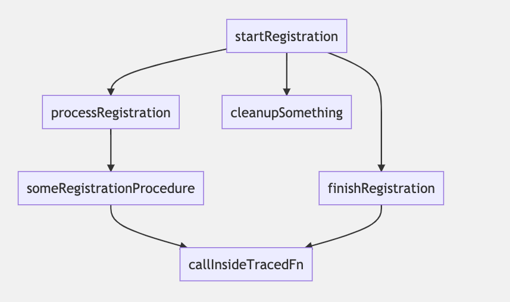

# statictrace

[日本語](README.JP.md)

## Requirements

Node.js 14.15.0 or later.

## Installation

### Install

`npm install @yumemi-inc/statictrace`

You can install `statictrace` either per-project or globally.

### Build from source

```
pnpm install
pnpm run build
```

### `ts-node`:

```
pnpx ts-node src/lib.ts -p /absolute/path/to/tsconfig.json
```

### Use as CLI

```
statictrace -- -p /absolute/path/to/tsconfig.json
```

You can omit the `-p` option by creating an `.env` file with a `TS_PROJECT_CONFIG` variable.

```
TS_PROJECT_CONFIG=/absolute/path/to/tsconfig.json
```

**Other options**

- `u, --use <printer>` (optional): choose one of default printer types (`text` or `mermaid`).

## Usage

`statictrace` begins static analysis of your code from a point that is explicitly hinted by a developer. For example, if you want to analyse the registration flow like below, you need to add a JSDoc hint to the function where the flow begins: `@entrypoint YourFlowName`.

```ts
/**
 * @entrypoint Registration
 */
function startRegistration() {
  processRegistration();
  finishRegistration();
  untracedFunction();
  cleanupSomething();
}
```

Just doing this produces no output but `statictrace` internally tracks all function and method calls that occur within `startRegistration()` and every function calls within those functions until there are no calls. In other words, it builds a static stacktrace. If there are any particular functions and methods that you want to test or document, for example to know whether some functions are called, their call order and parent/child relationship, you need to mark relevant functions with another special comment: `@trace`.

```ts
/** @trace */
function processRegistration() {
  someRegistrationProcedure();
}
```

With this `statictrace` produces the following output:

```
Entrypoint: Registration
startRegistration
        processRegistration
                someRegistrationProcedure
```

You can use this output as a snapshot of a stacktrace, and use it from your testing library of choice to guarantee that the flow does not change after e.g. refactoring. You can also output the stacktrace as [`mermaid`](https://mermaid-js.github.io/mermaid/#/) graphs for documentation purposes (see picture below).

## Examples

- Output the result as indented text similar to a debugger stacktrace:

```sh
$ statictrace

=======================
Entrypoint: SomeEntrypoint
begin
        funcA
                funcC
        beingNestedEntrypoint
                funcA
                        funcC
                funcB
        funcB
```

- Output the result printed as mermaid graphs to a markdown file: `statictrace -u mermaid > graphs.md`

This is how rendered mermaid graphs look like:



### Use API programmatically

```js
const { run } = require('./build/lib');
const output = run('/absolute/path/to/tsconfig.json', 'text');
// ...do something with output
```

#### `run(pathToTsConfig: string, printerType: "text" | "mermaid"): any`

Load all project files and build a graph of all function calls marked with `@entrypoint` or `@trace` tags. You should pass a printer type as a second argument. A printer is an interface that represents anything that can print (display the static analysis result in one way or another). Currently you cannot provide your own implementations but can choose one of the default ones.
