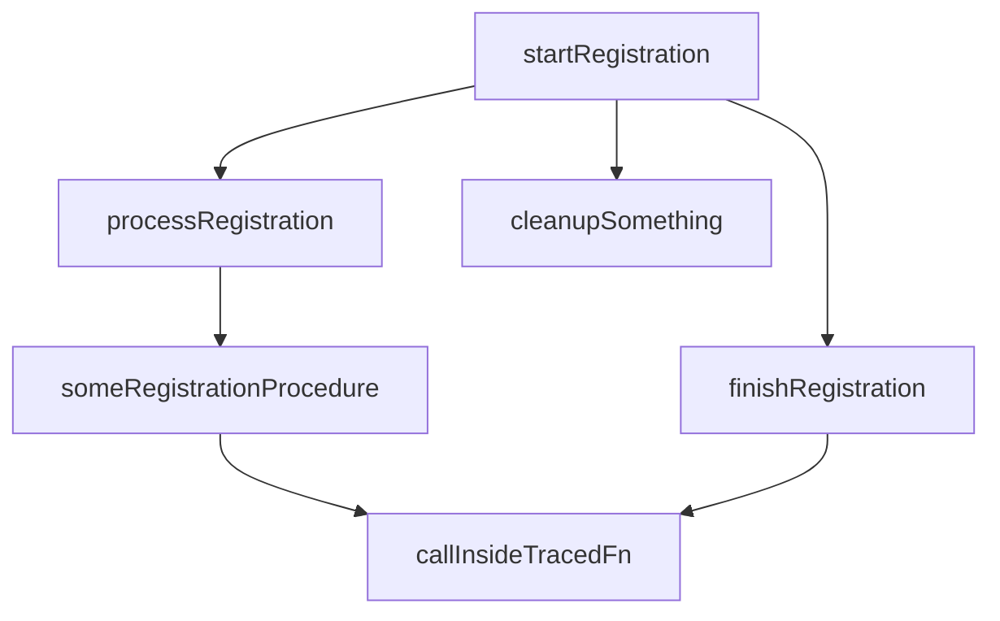
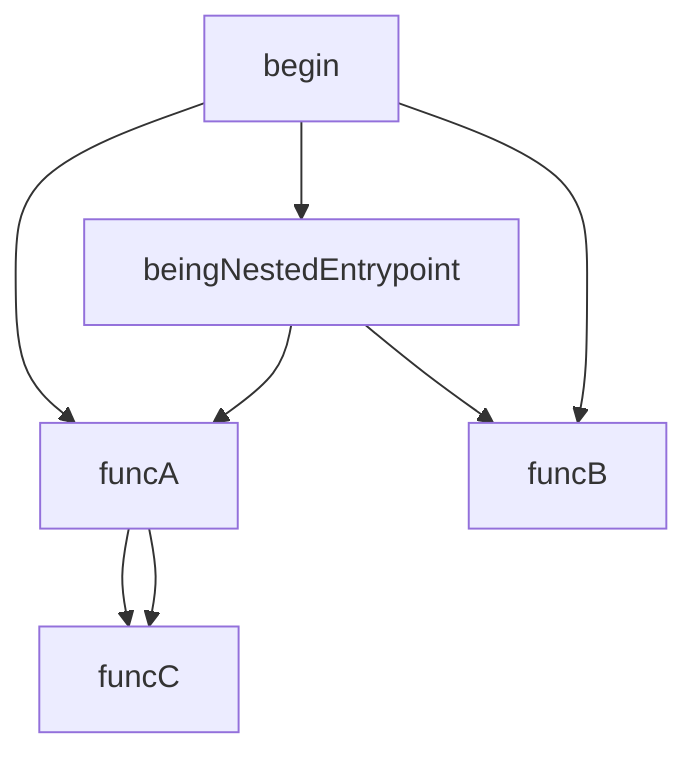
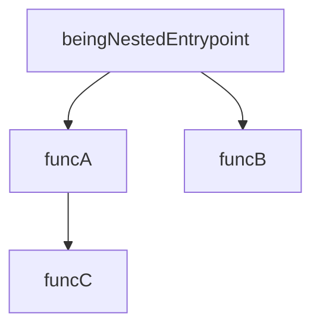
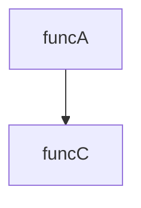
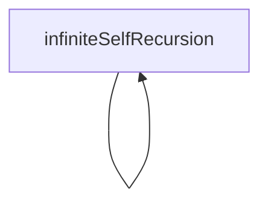
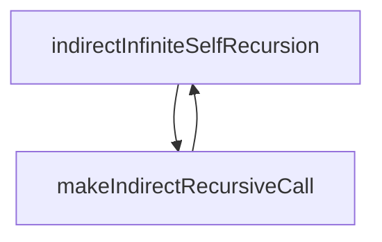

```mermaid
graph TD
	Database constructor --> get
	Database constructor --> saveUser
	saveUser --> post
```

```mermaid
graph TD
	startRegistration --> processRegistration
	processRegistration --> someRegistrationProcedure
	someRegistrationProcedure --> callInsideTracedFn
	startRegistration --> finishRegistration
	finishRegistration --> callInsideTracedFn
	startRegistration --> cleanupSomething
```

```mermaid
graph TD
	begin --> funcA
	funcA --> funcC
	begin --> beingNestedEntrypoint
	beingNestedEntrypoint --> funcA
	funcA --> funcC
	beingNestedEntrypoint --> funcB
	begin --> funcB
```

```mermaid
graph TD
	beingNestedEntrypoint --> funcA
	funcA --> funcC
	beingNestedEntrypoint --> funcB
```

```mermaid
graph TD
	funcA --> funcC
```

```mermaid
graph TD
	infiniteSelfRecursion --> infiniteSelfRecursion
```

```mermaid
graph TD
	indirectInfiniteSelfRecursion --> makeIndirectRecursiveCall
	makeIndirectRecursiveCall --> indirectInfiniteSelfRecursion
```